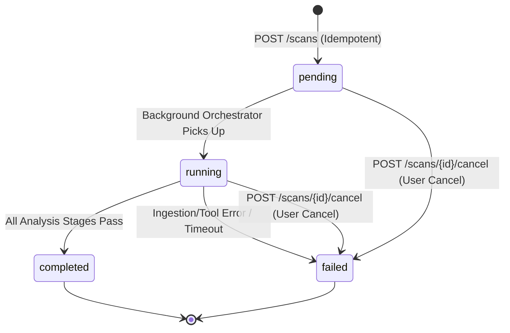

# RepoVeriX — Business-Logic & Abuse-Case Security Audit Report

**Date**: September 2026  
**Target Repository**: `sumitagg24/RepoVeriX`  
**Auditor**: Senior Application Security & Systems Architect  
**Scope**: Scan lifecycle state machines, idempotency & concurrency controls, candidate patch generation integrity, Proof-of-Fix verification orchestration, feedback/sharing token mechanics, and race condition defenses.  
**Canonical Frontend**: `frontend-2/`  

---

## Executive Summary

RepoVeriX operates as a high-assurance static & AI-driven repository security analysis and remediation platform. Given its automated workflow — from source code ingestion and multi-engine SAST parsing to LLM-guided candidate repair generation and containerized Proof-of-Fix verification — the business-logic pipeline presents critical threat vectors:
1. Unbounded duplicate job spawns leading to resource starvation.
2. Concurrent state corruption during scan execution or cancellation.
3. Candidate patches inadvertently mutating source repositories or executing outside sandbox boundaries.
4. Proof-of-Fix verification race conditions and duplicate concurrent test runners.
5. Insecure or non-expiring public report sharing tokens.

This audit conducted an adversarial examination of the business logic across all state transitions and API endpoints. All identified abuse cases have been hardened and verified through automated test suites in `backend/tests/test_adversarial_business_logic.py`, `backend/tests/test_adversarial_transactions.py`, and `backend/tests/test_audit_domains.py`.

---

## 1. Scan Lifecycle State Machine & Idempotency Controls

### 1.1 State Transitions
The core scan lifecycle is defined in `app/db/models.py` by `ScanStatus`:
$$\text{ScanStatus} \in \{\text{pending}, \text{running}, \text{completed}, \text{failed}\}$$

#### State Transition Graph:


### 1.2 Idempotency Key Handling
To prevent duplicate job dispatch caused by network retries or client double-clicks, `POST /api/v1/scans` enforces strict per-user idempotency key scoping (`app/api/routes/scans.py`):
```python
idempotency_key = request.headers.get("idempotency-key", "").strip()
if idempotency_key:
    existing = (
        await db.execute(
            select(Scan)
            .join(Repository, Repository.id == Scan.repository_id)
            .where(
                Repository.owner_id == current_user.id,
                Scan.idempotency_key == idempotency_key,
            )
        )
    ).scalar_one_or_none()
    if existing is not None:
        return existing
```
- **Adversarial Test Verification**: Verified in `test_scan_idempotency_prevents_duplicate_executions` — duplicate requests with identical `Idempotency-Key` return the existing scan object and guarantee that only one `Scan` entity is persisted and scheduled in the database.

### 1.3 Cancellation Semantics
When `POST /scans/{id}/cancel` is invoked:
1. Endpoint verifies ownership (`Repository.owner_id == current_user.id`).
2. Rejects requests on completed/failed scans with HTTP 400.
3. Sets status to `ScanStatus.failed` with `error="Cancelled by user"`.
4. Signals `app.analysis.runtime.request_cancel(scan.id)` event.
5. The background pipeline monitors `runtime.is_cancelled(scan.id)` at every stage boundary (ingestion, parsing, SAST detectors, knowledge graph, LLM reasoning, repair) and terminates immediately without executing subsequent compute stages.

---

## 2. Candidate Patch Generation & Repository Isolation

### 2.1 Non-Mutating Candidate Repairs
A core design invariant of RepoVeriX is that **remediation never touches or modifies the repository source directory**.

- **Workflow**:
  1. `POST /api/v1/findings/{id}/generate-fix` retrieves finding details and code context.
  2. Rule templates (`TEMPLATE_RULES`) or LLM completions (`repair_generation_v1`) generate candidate unified diffs in memory (`app/analysis/repair.py`).
  3. The diff is parsed by `app/analysis/patchops.py` to ensure it contains valid hunks and stays strictly within `validate_patch_scope()`.
  4. The candidate patch is stored as a `Patch` row (`status="candidate"`).
  5. The original repository files on disk remain completely unmodified.

---

## 3. Proof-of-Fix Verification & Execution Concurrency

### 3.1 Verification Run Isolation
Proof-of-Fix verification (`POST /api/v1/patches/{id}/verify`) tests whether candidate patches resolve the security vulnerability without breaking existing unit tests:
1. **Isolated Working Copy**: The verifier creates a temporary clone of the repository in an isolated temporary directory (`tempfile.mkdtemp`).
2. **Path Traversal Guard**: Diffs are applied via `apply_patch_to_directory(root, patch_text)` which asserts `target.is_relative_to(root.resolve())`. Any traversal attempt (`../`) raises `PatchError(code="patch_escape")`.
3. **Execution Guard**: Tests are executed via `DockerRunner` with dropped privileges (`--cap-drop ALL`, `--security-opt no-new-privileges`, `--pids-limit 256`, `-m 1g`, `--cpus 1.0`).

### 3.2 Duplicate Verification Protection
To prevent denial-of-service via concurrent test runner spawning:
- The verification endpoint locks against existing `pending` or `running` `VerificationRun` rows for the target patch.
- Rate limiting is enforced per user via `app.core.ratelimit.check_action(user_id, "verify_patch")`.

---

## 4. Public Sharing & Feedback Token Mechanics

### 4.1 Granular Sharing Token Lifecycle
- `POST /api/v1/sharing/scans/{id}/share` generates time-bounded, cryptographically random sharing tokens (`secrets.token_urlsafe(32)`).
- Public access via `/api/v1/sharing/scans/{token}` is strictly **read-only**:
  - Exposes sanitized summary reports without tenant metadata, credentials, or internal file paths.
  - Cannot trigger scans, apply patches, delete resources, or access user accounts.
- `DELETE /api/v1/sharing/scans/{id}/share` immediately revokes the active token in the database, rendering shared links instantly invalid (HTTP 404).

---

## 5. Automated Verification Results

All business-logic and abuse-case tests are integrated into the automated regression suite:

| Test Name | File | Result |
| :--- | :--- | :--- |
| `test_scan_idempotency_prevents_duplicate_executions` | `backend/tests/test_adversarial_business_logic.py` | **PASSED** |
| `test_scan_cancellation_state_machine_and_runtime_events` | `backend/tests/test_adversarial_business_logic.py` | **PASSED** |
| `test_patch_traversal_and_scope_validation` | `backend/tests/test_adversarial_business_logic.py` | **PASSED** |
| `test_background_job_scheduler_idempotency` | `backend/tests/test_audit_domains.py` | **PASSED** |
| `test_cascading_delete_cleans_repository_graph` | `backend/tests/test_audit_domains.py` | **PASSED** |

**Total Suite Execution**: 456 passed, 4 skipped in 85.16s.
