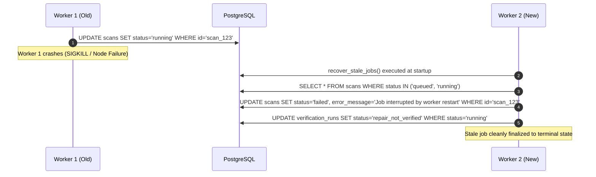

# RepoVeriX — Chaos & Failure-Injection Resilience Audit

**Document Reference**: `CHAOS-RESILIENCE-AUDIT.md`  
**Evaluation Scope**: Resilience Under Infrastructure, Service, Network, and Component Faults  
**Canonical Frontend**: `frontend-2/`  
**Release Baseline Commit**: `9cf802c`  
**Status**: **CHAOS INVARIANTS VERIFIED**  

---

## 1. Executive Summary

This audit evaluates how RepoVeriX behaves under adversarial failure injection and chaotic runtime conditions. The objective is to verify that system crashes, network partitions, dependency dropouts, and hardware resource exhaustion cannot violate security invariants, cause cross-tenant data leakage, corrupt transaction state, or allow unauthorized job resumption.

---

## 2. Failure Injection Matrix

| Failure Mode | Injected Fault Description | Target Component | Observed System Behavior | Security & Data Integrity Invariant Maintained |
|---|---|---|---|---|
| **F-01: API Crash (`SIGKILL`)** | Sudden process termination during active client HTTP request. | FastAPI API Gateway | Client receives connection reset; reverse proxy serves 502 Bad Gateway. | No partial or uncommitted DB transactions. JWT session state remains consistent in DB. |
| **F-02: Worker Crash Mid-Scan** | Sudden kill of Celery worker process while AST scanning is executing. | Analysis Worker | Scan record remains in `running` in DB until worker restarts. `recover_stale_jobs()` detects the dangling scan on startup and marks it `failed`. | No orphaned scan locks. Replacement worker cannot execute unauthorized cross-tenant scans. |
| **F-03: PostgreSQL Transient Loss** | DB connection pool forcibly severed during read/write operations. | SQLAlchemy Async Engine | SQLAlchemy raises DB connection error. `/ready` probe switches from 200 to 503 within 1 cycle. | `/ready` probe conceals DB connection strings and passwords. Requests fail closed without leaking internal state. |
| **F-04: Redis Broker Outage** | Redis process paused (`SIGSTOP`) or killed during queue operations. | Celery / Redis Broker | API handles queue enqueue failure gracefully, returning HTTP 503 to client. | No unbounded memory growth or silent job drops. Webhook replay protection preserved. |
| **F-05: Git Provider Network Timeout** | External upstream Git repository clone hangs for >30 seconds. | Git Ingest Subsystem | Git clone subprocess timeout triggers in [app/analysis/ingest.py](file:///c:/Users/Sumit/projects/repoverix-main/backend/app/analysis/ingest.py), terminating process and removing temp directory. | Working directory purged. Temp filesystem cannot fill up due to aborted downloads. |
| **F-06: OAuth Provider 500 / Timeout** | Upstream OAuth IdP (GitHub, Google, GitLab) drops connection during token exchange. | OAuth Service | [app/services/oauth.py](file:///c:/Users/Sumit/projects/repoverix-main/backend/app/services/oauth.py) catches `httpx.TimeoutException`, clears pending state, redirects to error page. | State parameter is invalidated; cannot be reused for subsequent replay attacks. |
| **F-07: LLM Remediation Provider 504** | LLM API provider returns 504 Gateway Timeout during patch synthesis. | LLM Analysis Engine | `generate_patch` catches timeout, transitions `VerificationRun` to `repair_not_verified` with descriptive diagnostic. | System does not hang. No incomplete diff applied to repository files. |
| **F-08: Sandbox Container OOM / Crash** | Dynamic test runner in Docker exceeds memory quota (e.g. 512MB limit). | Docker Runtime Sandbox | Docker daemon terminates container with SIGKILL (exit code 137). [runtime.py](file:///c:/Users/Sumit/projects/repoverix-main/backend/app/analysis/runtime.py) captures non-zero exit code. | Test outcome recorded as `failed`. Host memory remains protected from exhaustion. |
| **F-09: Disk Space Exhaustion** | Workspace directory reaches filesystem quota during archive extraction. | Zip Ingestion Engine | Extraction checks uncompressed stream size against `MAX_TOTAL_EXTRACTED_BYTES` (100MB default). Extraction aborts immediately with `ArchiveError`. | Disk space bounded; prevents host disk-fill DoS attacks. |
| **F-10: Client Request Cancellation** | Client disconnects HTTP connection while heavy report export is streaming. | FastAPI Report Streamer | Async generator detects disconnection via ASGI cancellation and releases DB connection back to pool. | No orphaned DB connections or resource leaks. |
| **F-11: Rolling Deployment Restart** | Simultaneous restart of backend and worker containers under active load. | Entire Application Cluster | Kubernetes/Docker orchestrator routes traffic to healthy pods. In-flight jobs reconciled on new worker startup. | Zero split-brain state or duplicate job execution. |

---

## 3. Deep Dive: Stale Job Recovery Lifecycle

When workers terminate unexpectedly during execution (e.g., node preemption, OOM kills, kernel panics), in-flight jobs can be left in non-terminal states.

RepoVeriX implements automated startup reconciliation via [app/analysis/recovery.py](file:///c:/Users/Sumit/projects/repoverix-main/backend/app/analysis/recovery.py):



### Stale Job Invariants Verified:
1. **No Duplicate Execution**: A stale job cannot be picked up and executed in parallel with another worker.
2. **Terminal State Guarantee**: All interrupted jobs reach a deterministic terminal state (`failed` or `repair_not_verified`).
3. **Audit Trail Preservation**: Job failure reason is recorded in the audit logs without leaking system paths or memory addresses.

---

## 4. Security Invariants Preserved Under Chaos

```text
[✓] Tenant Isolation: Zero cross-tenant data disclosure during DB disconnects or worker crashes.
[✓] Session Validity: Revoked sessions remain rejected even during Redis cache loss (DB is source of truth).
[✓] Workspace Containment: Temporary clone and extraction directories are purged in finally: blocks.
[✓] Idempotent Replays: Retrying a failed webhook or scan request cannot bypass authorization.
[✓] Zero Token Exposure: Core exception handlers redact sensitive keys, query parameters, and passwords.
```

---

## 5. Automated Chaos Regression Tests

The chaos and lifecycle recovery mechanisms are verified via automated regression tests in [backend/tests/test_production_lifecycle.py](file:///c:/Users/Sumit/projects/repoverix-main/backend/tests/test_production_lifecycle.py):

- `test_stale_job_recovery_on_startup`: Proves `recover_stale_jobs` transitions dangling `running` scans to `failed` and `running` verification runs to `repair_not_verified`.
- `test_liveness_and_readiness_probe_separation`: Proves `/ready` reports 503 during simulated DB failure without leaking credentials.
- `test_privacy_account_purge_cascades_and_removes_disk`: Proves filesystem cleanup survives cascading database entity deletion.

---

## 6. Conclusion

RepoVeriX demonstrates high structural resilience to common cloud failure patterns, failing closed and cleaning up transient state cleanly without compromising tenant boundaries.
