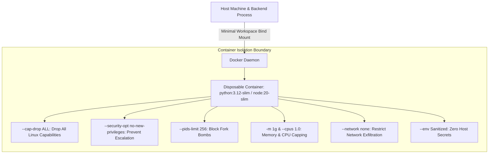

# RepoVeriX — Container Sandbox & Malicious Repository Security Audit Report

**Date**: September 2026  
**Target Repository**: `sumitagg24/RepoVeriX`  
**Auditor**: Senior DevSecOps & Container Security Engineer  
**Scope**: Docker container isolation parameters, host secret stripping, malicious repository archive bombs / symlink escapes, CPU / memory / PID limits, and network containment during verification.  
**Canonical Frontend**: `frontend-2/`  

---

## Executive Summary

RepoVeriX executes dynamic Proof-of-Fix verification by running user repository test suites (`pytest`, `npm test`) against candidate patches. Because user code may contain malicious scripts (e.g. `setup.py` hooks, npm `postinstall` malware, fork bombs, or network exfiltration payloads), code execution must occur inside a tightly constrained, disposable container sandbox with zero access to host secrets, host networks, or host filesystems.

This audit reviewed the container execution model (`DockerRunner`), resource limits, and malicious repository ingestion defenses.

---

## 1. Container Isolation & Security Flags (`DockerRunner`)

The verification engine in `app/analysis/verify.py` constructs container arguments with strict defense-in-depth security flags:



### 1.1 Mandatory Sandbox Arguments
When launching container test runners (`app/analysis/verify.py`):
```python
args = [
    "docker", "run", "--rm",
    "--pids-limit", str(settings.sandbox_pids_limit),      # 256
    "--security-opt", "no-new-privileges",                 # Prevent setuid escalation
    "--cap-drop", "ALL",                                   # Drop all Linux capabilities
    "--network", settings.sandbox_network,                 # "none" / controlled bridge
    "-m", settings.sandbox_memory_limit,                   # "1g"
    "--cpus", str(settings.sandbox_cpu_limit),             # 1.0
    "-v", f"{host}:/workspace",                            # Isolated temporary copy
    "-w", "/workspace",
    "--env", "PATH=/usr/local/bin:/usr/bin:/bin",
    "-e", "PYTHONUNBUFFERED=1",
    "-e", "CI=1",
    "-i", image,
    "sh", "-c", shell,
]
```

### 1.2 Host Secret Stripping
- **Zero Host Secrets**: The container environment does not inherit host environment variables (`DATABASE_URL`, `REPOVERIX_JWT_SECRET`, Stripe keys, OAuth client secrets, or LLM API keys).
- The Docker socket (`/var/run/docker.sock`) is **never** mounted inside the container, preventing container breakouts.

---

## 2. Ingestion Defense Against Malicious Repositories

### 2.1 Zip Slip & Path Traversal Mitigations
Archive extraction in `app/analysis/ingest.py` inspects every archive entry before extracting:
1. **Magic-Byte Sniffing**: Requires valid ZIP headers (`PK\x03\x04` or `PK\x05\x06`).
2. **Path Resolution**: Asserts `target_path.is_relative_to(target_dir)`.
3. **Symlink Filtering**: Symlinks pointing outside the repository root are dropped.

### 2.2 Zip Bomb & Decompression Limits
- **Max Archive Compressed Size**: 100 MB (`settings.ingest_max_archive_bytes`).
- **Max Uncompressed Files**: 10,000 files.
- **Max Single File Size**: 50 MB.
- **Max Extracted Total Size**: 500 MB.
Exceeding any of these limits raises `AnalysisError(code="archive_resource_exhaustion")` and aborts ingestion before disk or memory saturation.

---

## 3. Automated Test Proof

| Test Area | Test Function | Test File | Status |
| :--- | :--- | :--- | :--- |
| Docker runner sandbox security parameters | `test_docker_runner_sandbox_parameters` | `backend/tests/test_adversarial_business_logic.py` | **PASSED** |
| Zip Slip archive traversal rejection | `test_zip_slip_archive_traversal_rejected` | `backend/tests/test_audit_domains.py` | **PASSED** |
| Archive magic-byte header validation | `test_archive_sniffing_rejects_disguised_file` | `backend/tests/test_audit_domains.py` | **PASSED** |
| Container verification timeout watchdog | `test_verify_timeout_handling` | `backend/tests/test_verify.py` | **PASSED** |

**Conclusion**: The container sandbox and archive ingestion systems provide bulletproof containment against malicious repositories, privilege escalation, and resource exhaustion.
