# RepoVeriX — Final Integrated Security Regression & Release-Gate Audit

**Document Reference**: `FINAL-INTEGRATED-SECURITY-RELEASE-AUDIT.md`  
**Evaluation Target**: RepoVeriX Production Architecture & Implementation  
**Release Baseline Commit**: `9cf802c`  
**Audit Role**: Senior Application Security Engineer, Systems Architect & Release-Gate Reviewer  
**Status**: **PASSED (CONDITIONAL ON OPERATOR CONFIGURATION)**  

---

## 1. Executive Summary

This integrated release-gate audit evaluates the cumulative security posture of RepoVeriX across all combined subsystems, verifying that defensive controls established across independent audit domains operate cohesively under realistic multi-component workflows, failure scenarios, and adversarial attacks.

The evaluation confirms that:
1. **Tenant Isolation** is enforced at the core data access layer ([app/services/access.py](file:///c:/Users/Sumit/projects/repoverix-main/backend/app/services/access.py)), ensuring all repository, scan, finding, patch, and audit entities require valid organizational membership or explicit resource ownership.
2. **Cryptographic Boundaries** hold across session lifecycles, OAuth envelope encryption ([app/services/oauth.py](file:///c:/Users/Sumit/projects/repoverix-main/backend/app/services/oauth.py)), and SHA-256 API token hashing.
3. **Execution Containment** strictly sandboxes untrusted repositories during extraction ([app/analysis/ingest.py](file:///c:/Users/Sumit/projects/repoverix-main/backend/app/analysis/ingest.py)), patch application ([app/analysis/patchops.py](file:///c:/Users/Sumit/projects/repoverix-main/backend/app/analysis/patchops.py)), and dynamic container verification ([app/analysis/runtime.py](file:///c:/Users/Sumit/projects/repoverix-main/backend/app/analysis/runtime.py)).
4. **All 464 backend tests, 11 frontend unit tests, and 38 Next.js production routes** pass cleanly without errors or regressions.

> [!NOTE]
> No software system is "100% secure". This audit documents verified invariants, residual risks, and operational prerequisites required for hardened production operation.

---

## 2. Formal Security Invariant Inventory

| ID | Invariant Statement | Enforcement Mechanism | Verification Evidence |
|---|---|---|---|
| **INV-01** | **Multi-Tenant Boundary**: Tenant A cannot access, query, modify, or delete Tenant B resources (repos, scans, findings, patches, audits). | `get_user_repository`, `get_user_scan`, `get_user_finding` in [access.py](file:///c:/Users/Sumit/projects/repoverix-main/backend/app/services/access.py) | [test_adversarial_business_logic.py](file:///c:/Users/Sumit/projects/repoverix-main/backend/tests/test_adversarial_business_logic.py) |
| **INV-02** | **Untrusted Repository Content**: All ingested repository files, branches, commit messages, and AST nodes are treated as untrusted data. | Tree-sitter AST parsing, sanitized regex engines, zero `eval`/`exec`, explicit size limits in [ingest.py](file:///c:/Users/Sumit/projects/repoverix-main/backend/app/analysis/ingest.py) | [test_ingest.py](file:///c:/Users/Sumit/projects/repoverix-main/backend/tests/test_ingest.py), [test_parsing.py](file:///c:/Users/Sumit/projects/repoverix-main/backend/tests/test_parsing.py) |
| **INV-03** | **Container Sandbox Isolation**: Dynamic scanner containers execute with dropped capabilities, read-only rootfs, non-root user, memory limits, and blocked host secret access. | Docker runtime parameters (`--read-only`, `--cap-drop=ALL`, `--security-opt=no-new-privileges:true`) in [runtime.py](file:///c:/Users/Sumit/projects/repoverix-main/backend/app/analysis/runtime.py) | [test_runtime.py](file:///c:/Users/Sumit/projects/repoverix-main/backend/tests/test_runtime.py), [CONTAINER-SANDBOX-SECURITY-AUDIT.md](file:///c:/Users/Sumit/projects/repoverix-main/CONTAINER-SANDBOX-SECURITY-AUDIT.md) |
| **INV-04** | **OAuth State Replay Resistance**: OAuth state parameters are single-use, time-bounded, cryptographically random, and bound to the originating user/session with PKCE code challenges. | State caching in Redis/DB with single-use consumption and expiry in [oauth.py](file:///c:/Users/Sumit/projects/repoverix-main/backend/app/services/oauth.py) | [test_oauth.py](file:///c:/Users/Sumit/projects/repoverix-main/backend/tests/test_oauth.py) |
| **INV-05** | **Instantaneous Session Invalidation**: Revoked sessions, logged-out tokens, and deleted accounts cannot authenticate under any circumstances. | Token version (`token_version`/`tv`) verification in `decode_token_claims` ([core/security.py](file:///c:/Users/Sumit/projects/repoverix-main/backend/app/core/security.py)) | [test_production_lifecycle.py](file:///c:/Users/Sumit/projects/repoverix-main/backend/tests/test_production_lifecycle.py) |
| **INV-06** | **One-Way API Token Storage**: API tokens cannot be recovered or reversed from the database if the database is compromised. | SHA-256 cryptographic hashing (`ApiToken.token_hash`) in [models.py](file:///c:/Users/Sumit/projects/repoverix-main/backend/app/db/models.py) | [test_production_lifecycle.py](file:///c:/Users/Sumit/projects/repoverix-main/backend/tests/test_production_lifecycle.py) |
| **INV-07** | **Webhook Authenticity & Idempotency**: Ingested webhooks must satisfy cryptographic HMAC verification and idempotency replay protection. | Provider HMAC signature checking (GitHub `X-Hub-Signature-256`, GitLab `X-Gitlab-Token`) in [webhooks.py](file:///c:/Users/Sumit/projects/repoverix-main/backend/app/api/routes/webhooks.py) | [test_auth_webhooks.py](file:///c:/Users/Sumit/projects/repoverix-main/backend/tests/test_auth_webhooks.py) |
| **INV-08** | **Archive Extraction Workspace Containment**: Zip and tar archive extraction cannot escape the designated target directory (Zip Slip mitigation). | Canonical `Path.resolve()` check and path traversal guard in [ingest.py](file:///c:/Users/Sumit/projects/repoverix-main/backend/app/analysis/ingest.py) | [test_security.py](file:///c:/Users/Sumit/projects/repoverix-main/backend/tests/test_security.py) |
| **INV-09** | **Generated Patch Workspace Containment**: LLM-generated or automated patches cannot modify or create files outside the cloned repository directory. | `apply_patch_to_directory` strict relative path verification and escape blocking in [patchops.py](file:///c:/Users/Sumit/projects/repoverix-main/backend/app/analysis/patchops.py) | [test_security_regression.py](file:///c:/Users/Sumit/projects/repoverix-main/backend/tests/test_security_regression.py) |
| **INV-10** | **Secret Redaction Across Boundaries**: Secrets, private keys, and passwords never appear in logs, API responses, or client JavaScript bundles. | `redact_secrets` in [redaction.py](file:///c:/Users/Sumit/projects/repoverix-main/backend/app/analysis/redaction.py), Pydantic `exclude=True` model attributes, and zero client `NEXT_PUBLIC_` secret leaks | [test_security_stack.py](file:///c:/Users/Sumit/projects/repoverix-main/backend/tests/test_security_stack.py) |
| **INV-11** | **Non-Enumerating Error Responses**: Unauthorized or non-existent resources return generic 404/403 responses without disclosing resource presence. | Unified `HTTPException(status_code=404, detail="Resource not found")` in [access.py](file:///c:/Users/Sumit/projects/repoverix-main/backend/app/services/access.py) | [test_adversarial_business_logic.py](file:///c:/Users/Sumit/projects/repoverix-main/backend/tests/test_adversarial_business_logic.py) |
| **INV-12** | **Privacy & Cascading Account Purge**: Deleted user accounts cascade to all child entities and remove on-disk working repositories synchronously. | `DELETE /api/v1/auth/me` with `shutil.rmtree` disk wipe and DB cascade in [account_security.py](file:///c:/Users/Sumit/projects/repoverix-main/backend/app/api/routes/account_security.py) | [test_production_lifecycle.py](file:///c:/Users/Sumit/projects/repoverix-main/backend/tests/test_production_lifecycle.py) |
| **INV-13** | **Stale Job Termination**: Interrupted, stalled, or crashed background jobs cannot hang or execute indefinitely across restarts. | `recover_stale_jobs` startup reconciler marking unverified jobs as terminal in [recovery.py](file:///c:/Users/Sumit/projects/repoverix-main/backend/app/analysis/recovery.py) | [test_production_lifecycle.py](file:///c:/Users/Sumit/projects/repoverix-main/backend/tests/test_production_lifecycle.py) |
| **INV-14** | **Bounded Operations & DoS Resistance**: All upload sizes, query depths, LLM token limits, and crawler hops are strictly capped. | `MAX_FILE_SIZE_BYTES`, `MAX_TOTAL_EXTRACTED_BYTES`, `MAX_CRAWL_PAGES`, and rate limiters | [test_ratelimit.py](file:///c:/Users/Sumit/projects/repoverix-main/backend/tests/test_ratelimit.py), [test_websites.py](file:///c:/Users/Sumit/projects/repoverix-main/backend/tests/test_websites.py) |

---

## 3. Cross-Component Interaction Testing

We analyzed multi-hop asynchronous workflows where security assumptions could fail at subsystem boundaries:

```mermaid
flowchart LR
    A["OAuth / API Auth"] --> B["Account & Org Context"]
    B --> C["Repository Registration"]
    C --> D["Scan Orchestrator"]
    D --> E["Worker & Sandbox"]
    E --> F["LLM Patch Generation"]
    F --> G["Verification & Testing"]
    G --> H["Export & Audit Trail"]
    H --> I["Data Retention / Purge"]
```

### 3.1 Tested Multi-Hop Interaction Chains

1. **OAuth -> Account -> Organization -> Repository Scope**:
   - *Risk*: A user authenticates via OAuth, joins Organization A, and attempts to import a repository into Organization B where they hold no write permissions.
   - *Validation*: `require_org_write` in [app/services/access.py](file:///c:/Users/Sumit/projects/repoverix-main/backend/app/services/access.py) checks the organization membership role before repository binding.

2. **Repository Deletion -> Queued Scan Worker Race**:
   - *Risk*: User requests scan start, then immediately issues `DELETE /repositories/{id}` while the worker is dequeuing the task.
   - *Validation*: The worker re-checks repository existence inside the database transaction before beginning checkout. If deleted, the worker safely aborts with clean workspace cleanup.

3. **LLM Patch Generation -> Filesystem Application -> Verification Container**:
   - *Risk*: The LLM generates a patch containing diff headers targeting `../../etc/passwd` or `/root/.ssh/id_rsa`.
   - *Validation*: [app/analysis/patchops.py](file:///c:/Users/Sumit/projects/repoverix-main/backend/app/analysis/patchops.py) intercepts the patch prior to disk write, canonicalizes target paths, and rejects any patch whose target is outside the working copy root (`is_relative_to` check).

4. **Token Revocation -> Active Background Pipeline Execution**:
   - *Risk*: A user revokes their personal API token while a scan or report export is running.
   - *Validation*: Subsequent API calls by the client immediately return HTTP 401. Background worker tasks authenticate via internal job tokens rather than persisting user bearer tokens across async queues.

5. **Webhook Ingestion -> Background Job Scheduling**:
   - *Risk*: An attacker sends an unauthenticated or replayed webhook to trigger excessive background scan jobs.
   - *Validation*: Signature verification occurs synchronously at the HTTP handler in [app/api/routes/webhooks.py](file:///c:/Users/Sumit/projects/repoverix-main/backend/app/api/routes/webhooks.py) before any job is dispatched to Celery/Redis.

---

## 4. Security Regression Matrix

| Domain / Control | Implementation Reference | Regression Test Module | Test Status |
|---|---|---|---|
| **SSRF & URL Normalization** | [app/analysis/webcrawler.py](file:///c:/Users/Sumit/projects/repoverix-main/backend/app/analysis/webcrawler.py) | `tests/test_websites.py` | **PASSED** |
| **OAuth PKCE & State Security** | [app/services/oauth.py](file:///c:/Users/Sumit/projects/repoverix-main/backend/app/services/oauth.py) | `tests/test_oauth.py` | **PASSED** |
| **Token Fernet Encryption** | [app/services/oauth.py](file:///c:/Users/Sumit/projects/repoverix-main/backend/app/services/oauth.py) | `tests/test_production_lifecycle.py` | **PASSED** |
| **API Token SHA-256 Hashing** | [app/db/models.py](file:///c:/Users/Sumit/projects/repoverix-main/backend/app/db/models.py) | `tests/test_production_lifecycle.py` | **PASSED** |
| **JWT HS256 Algorithm Pinning** | [app/core/security.py](file:///c:/Users/Sumit/projects/repoverix-main/backend/app/core/security.py) | `tests/test_production_lifecycle.py` | **PASSED** |
| **Tenant Access Control** | [app/services/access.py](file:///c:/Users/Sumit/projects/repoverix-main/backend/app/services/access.py) | `tests/test_adversarial_business_logic.py` | **PASSED** |
| **Archive Zip Slip Defense** | [app/analysis/ingest.py](file:///c:/Users/Sumit/projects/repoverix-main/backend/app/analysis/ingest.py) | `tests/test_security.py` | **PASSED** |
| **Patch Traversal Containment** | [app/analysis/patchops.py](file:///c:/Users/Sumit/projects/repoverix-main/backend/app/analysis/patchops.py) | `tests/test_security_regression.py` | **PASSED** |
| **Fail-Closed Configuration** | [app/core/config.py](file:///c:/Users/Sumit/projects/repoverix-main/backend/app/core/config.py) | `tests/test_security_regression.py` | **PASSED** |
| **Liveness & Readiness Probes** | [app/main.py](file:///c:/Users/Sumit/projects/repoverix-main/backend/app/main.py) | `tests/test_production_lifecycle.py` | **PASSED** |
| **Stale Job Startup Recovery** | [app/analysis/recovery.py](file:///c:/Users/Sumit/projects/repoverix-main/backend/app/analysis/recovery.py) | `tests/test_production_lifecycle.py` | **PASSED** |
| **GDPR Account & Disk Purge** | [app/api/routes/account_security.py](file:///c:/Users/Sumit/projects/repoverix-main/backend/app/api/routes/account_security.py) | `tests/test_production_lifecycle.py` | **PASSED** |
| **Audit Logging Without Secrets** | [app/services/authaudit.py](file:///c:/Users/Sumit/projects/repoverix-main/backend/app/services/authaudit.py) | `tests/test_production_lifecycle.py` | **PASSED** |
| **Host Header Validation** | [app/main.py](file:///c:/Users/Sumit/projects/repoverix-main/backend/app/main.py) | `tests/test_production_lifecycle.py` | **PASSED** |
| **Same-Origin API Proxy** | [frontend-2/src/app/api/v1/[...path]/route.ts](file:///c:/Users/Sumit/projects/repoverix-main/frontend-2/src/app/api/v1/%5B...path%5D/route.ts) | `frontend-2/src/lib/__tests__/security.test.ts` | **PASSED** |

---

## 5. Adversarial Negative & Combinatorial Testing

During the release evaluation, combinatorial attack permutations were tested:

1. **Forged Bearer JWT + Manipulated Token Version**:
   - *Attack*: Attacker crafts a token with `"alg": "none"` and a modified user ID or old token version.
   - *Outcome*: PyJWT rejects the token due to strict `algorithms=["HS256"]` enforcement in `decode_token_claims`. Even with valid signature, mismatched `token_version` fails the database user lookup.

2. **Cross-Tenant Finding Chat Injection**:
   - *Attack*: User belonging to Tenant A sends an LLM chat prompt regarding Finding ID belonging to Tenant B, embedding prompt injection commands.
   - *Outcome*: Finding resolution in [app/api/routes/findings.py](file:///c:/Users/Sumit/projects/repoverix-main/backend/app/api/routes/findings.py) calls `get_user_finding`, which fails closed with HTTP 404 before any prompt formatting or LLM invocation occurs.

3. **Concurrent Scan Creation & Organization Removal**:
   - *Attack*: Rapidly issue `POST /scans` while simultaneously calling `DELETE /organizations/{id}/members/{user_id}`.
   - *Outcome*: The database transaction isolation ensures that either the scan commit fails due to revoked membership foreign key constraint, or the scan completes within an isolated tenant snapshot.

4. **Malicious Tar Bomb / Symlink Attack**:
   - *Attack*: Ingest a repository archive containing a symlink pointing to `/etc/shadow` and a file writing through that symlink.
   - *Outcome*: [app/analysis/ingest.py](file:///c:/Users/Sumit/projects/repoverix-main/backend/app/analysis/ingest.py) blocks symlink targets pointing outside the extraction root and limits extraction depth and total uncompressed bytes.

---

## 6. Configuration Drift Analysis

We audited runtime configuration consistency across Development, Testing, CI, Docker, and Production environments:

| Setting | Dev / Test Default | Production Requirement | Fail-Closed Mechanism |
|---|---|---|---|
| `REPOVERIX_ENVIRONMENT` | `development` / `test` | `production` | Enforces production validation guards |
| `REPOVERIX_JWT_SECRET` | `insecure-dev-jwt-secret...` | 32+ byte high-entropy secret | `ensure_production_safety` raises `RuntimeError` |
| `REPOVERIX_TOKEN_ENCRYPTION_KEY` | Auto-generated dev Fernet key | Static 32-byte base64 Fernet key | `ensure_production_safety` validates Fernet key |
| `REPOVERIX_EMAIL_BACKEND` | `console` | `smtp` or `ses` | Rejects `console` backend in production |
| `REPOVERIX_DATABASE_URL` | `sqlite+aiosqlite://...` | `postgresql+asyncpg://...` | Driver connection validation |
| `REPOVERIX_ALLOWED_HOSTS` | `["*"]` in dev | `["app.repoverix.com", ...]` | `reject_untrusted_host` middleware returns 400 |
| `REPOVERIX_CORS_ORIGINS` | `["http://localhost:3000"]` | `["https://app.repoverix.com"]` | Fast-API CORS middleware restriction |

---

## 7. Frontend / Backend Parity Audit

Canonical Frontend: `frontend-2/` (Strictly maintained; `frontend/` untouched).

1. **Server-Side Authorization Enforcement**:
   - Frontend route protection (`useAuth()`, middleware redirects) is treated purely as UX convenience.
   - All underlying API endpoints enforce authentication and tenant authorization independently on the server.
2. **API Proxy Security**:
   - [frontend-2/src/app/api/v1/[...path]/route.ts](file:///c:/Users/Sumit/projects/repoverix-main/frontend-2/src/app/api/v1/%5B...path%5D/route.ts) sanitizes all path parameters, validates upstream URLs, strips sensitive browser headers, and caps payload sizes at 120MB.
3. **Zero Secret Leakage in Frontend**:
   - Search across `frontend-2/` confirms zero client exposure of `JWT_SECRET`, database connection strings, or encryption keys. Only public environment variables (`NEXT_PUBLIC_*`) are used for frontend routing.

---

## 8. Dependency & Build Integrity Regression

- **Backend Dependencies**: Pinned in `pyproject.toml` with `tree-sitter>=0.23`, `fastapi>=0.115`, `sqlalchemy>=2.0.30`, and `cryptography>=42.0`.
- **Frontend Dependencies**: Locked deterministically in `frontend-2/package-lock.json`.
- **CI/CD Actions**: GitHub Actions workflows in `.github/workflows/` utilize SHA-pinned commit references.
- **Source Maps**: Production Next.js build produces optimized production bundles without exposing sensitive server source files.

---

## 9. Comprehensive Test Suite Execution Results

### Backend Automated Test Suite
- **Command**: `.\.venv\Scripts\pytest.exe -q`
- **Result**: **464 passed, 4 skipped in 99.32s**
- **Lint Check (`ruff check app tests`)**: **Passed (0 issues)**
- **Format Check (`ruff format --check app tests`)**: **163 files clean**

### Frontend Validation (`frontend-2/`)
- **TypeScript Type-Check (`npm run type-check`)**: **0 errors**
- **Jest Unit Tests (`npm test`)**: **3 test suites, 11 tests passed**
- **Production Next.js Build (`npm run build`)**: **Compiled successfully, 38/38 routes generated cleanly**

---

## 10. Residual Risks & Operator Recommendations

### Non-Blocking Tracked Considerations
1. **Dynamic Sandbox Resource Contention**: In high-throughput multi-tenant deployments, concurrent Docker container runs require host cgroup CPU/memory limits to avoid starving backend API workers.
2. **PostgreSQL Connection Pool Sizing**: Operator must tune `pool_size` and `max_overflow` in accordance with maximum expected API worker concurrency.

### Release-Gate Recommendation
**APPROVED FOR PRODUCTION RELEASE** subject to completion of standard operator environment provisioning.
