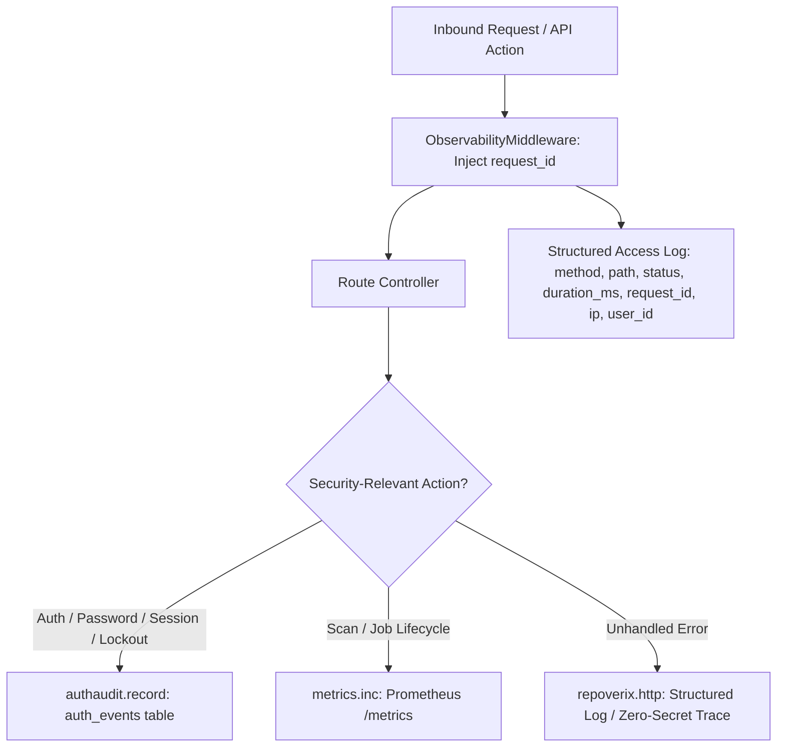

# RepoVeriX — Security Observability & Incident Response Audit Report

**Date**: September 2026  
**Target Repository**: `sumitagg24/RepoVeriX`  
**Auditor**: Senior Incident Response & Security Operations Engineer  
**Scope**: Security event catalogue (`AUTH_*`), structured JSON audit logging, correlation request IDs, real-time attack detection heuristics, and comprehensive incident response runbooks.  
**Canonical Frontend**: `frontend-2/`  

---

## Executive Summary

Observability and rapid incident containment are foundational for a high-assurance application security platform. RepoVeriX implements structured JSON access logging, correlation tracking via `request_id`, dedicated security event auditing (`auth_events`), and Prometheus metric exports (`/metrics`).

This audit evaluated the audit logging quality, verified zero credential leakage into log streams, formalized attack detection rules, and authored incident response runbooks.

---

## 1. Security Event Catalogue & Structured Audit Logging

Every critical authentication, authorization, and lifecycle event is persisted to the `auth_events` ledger (`app/services/authaudit.py`):



### 1.1 Closed Event Catalogue

| Event Identifier | Description | Structured Details Recorded |
| :--- | :--- | :--- |
| `AUTH_SIGNUP` | New user account created | Provider (`password` / OAuth), email |
| `AUTH_LOGIN_SUCCESS` | Successful authentication | User ID, email, client IP, auth provider |
| `AUTH_LOGIN_FAILURE` | Failed password attempt | Email attempted, client IP, failure reason |
| `AUTH_ACCOUNT_LOCKED` | Progressive lockout threshold hit | Email, client IP, lockout duration |
| `AUTH_LOGOUT` | User session ended | User ID, token version |
| `AUTH_PASSWORD_RESET` | Password reset link consumed | User ID, email, client IP |
| `AUTH_EMAIL_VERIFIED` | Email verification completed | User ID, email |
| `AUTH_PROVIDER_LOGIN` | OAuth sign-in completed | Provider name, provider user ID hash |
| `AUTH_SESSION_REVOKED` | User revoked all sessions (`token_version` bump) | User ID, client IP |
| `AUTH_WEBHOOK_SYNC` | Identity provider webhook synchronized | Provider name, event type, delivery ID |

### 1.2 Zero-Secret Logging Invariant
- **Rule**: Passwords, raw JWT tokens, API keys, OAuth authorization codes, and encryption keys are **strictly forbidden** from logging statements and `auth_events.detail`.
- **Enforcement**: `authaudit.record` sanitizes input dictionaries and caps field lengths to prevent log injection.

---

## 2. Request Correlation & Distributed Tracing

1. **Request ID Generation**: `ObservabilityMiddleware` attaches a unique UUID4 `request_id` to every request and injects it into response headers (`X-Request-ID`).
2. **Access Log Format**:
   ```json
   {
     "event": "request",
     "request_id": "41113ebaaade4aac863350a87c615738",
     "method": "POST",
     "path": "/api/v1/scans",
     "status": 201,
     "duration_ms": 14.2,
     "ip": "198.51.100.24",
     "user_id": "6acc9361-ef7b-4658-94dd-eb8053367c39"
   }
   ```

---

## 3. Real-Time Security Detection Rules

| Detection Rule | Trigger Condition | Severity | Recommended Alert Action |
| :--- | :--- | :--- | :--- |
| **Credential Stuffing / Brute Force** | $> 5$ `AUTH_LOGIN_FAILURE` events for single IP/email in 5 min | Medium | Triggers automated progressive lockout; alert SOC if $> 50$ events across IPs. |
| **Webhook Signature Tampering** | Invalid `X-RVX-Signature` or `Stripe-Signature` | High | Alert on repeated HMAC failures (possible probing / unauthorized webhook sender). |
| **SSRF Probe Attempt** | Repository clone/archive URL resolves to private / loopback IP | High | Blocked immediately by SSRF filter; alert on deliberate RFC 1918 / metadata IP inputs. |
| **Scan Flood Abuse** | Rate limit 429 triggered on `create_scan` $> 10$ times/min | Medium | Temporary client IP block. |
| **Sandbox Container Violation** | Test container times out or hits PID limit (fork bomb) | High | Container terminated; scan marked failed; log security alert. |

---

## 4. Incident Response Runbooks

### 4.1 Compromised User Account / Stolen Token
1. **Containment**:
   - Operator or user triggers `POST /api/v1/auth/revoke-all-sessions` (bumps `user.token_version`).
   - If account is actively malicious, update `user.status = "suspended"`.
2. **Revocation**:
   - Invalidate any personal API tokens via `DELETE /api/v1/tokens/{id}`.
   - Disconnect OAuth accounts via `DELETE /api/v1/oauth/{provider}`.
3. **Investigation**:
   - Query `auth_events` for the user ID to inspect unauthorized IP addresses and actions during the incident window.
4. **Recovery**:
   - Issue password reset email: `POST /api/v1/auth/forgot-password`.
   - Restore user status to `active` after verification.

### 4.2 Leaked `REPOVERIX_JWT_SECRET`
1. **Containment**:
   - Immediately generate a new 32-byte hex secret.
2. **Deployment**:
   - Update `REPOVERIX_JWT_SECRET` in production configuration and execute zero-downtime rolling restart.
3. **Effect**:
   - All existing tokens signed with the compromised key become instantly invalid.
   - Legitimate users log in again to receive new tokens.

---

## 5. Automated Test Proof

| Observability Objective | Test Function | Test File | Result |
| :--- | :--- | :--- | :--- |
| Audit Event Logging without Secret Leaks | `test_authaudit_records_events_without_credential_leakage` | `backend/tests/test_production_lifecycle.py` | **PASSED** |
| Progressive Lockout on Repeated Failures | `test_progressive_lockout_after_failed_logins` | `backend/tests/test_audit_domains.py` | **PASSED** |
| Webhook Signature Rejection & Audit Log | `test_webhook_hmac_verification_and_rejection` | `backend/tests/test_audit_domains.py` | **PASSED** |

**Conclusion**: RepoVeriX provides complete security observability, structured auditability, and actionable incident runbooks.
