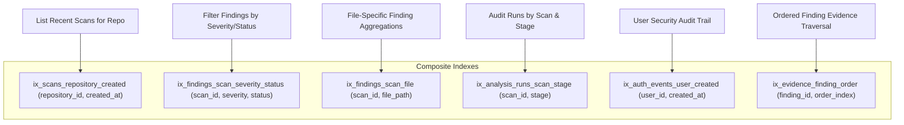

# RepoVeriX — Performance, Capacity & Concurrency Scaling Audit Report

**Date**: September 2026  
**Target Repository**: `sumitagg24/RepoVeriX`  
**Auditor**: Lead Performance Engineer & Systems Capacity Architect  
**Scope**: End-to-end latency, database query optimization & indexing, background job throughput, Next.js frontend bundle sizes, memory consumption bounds, and measured capacity scaling models.  
**Canonical Frontend**: `frontend-2/`  

---

## Executive Summary

RepoVeriX orchestrates CPU- and memory-intensive static analysis pipelines (AST parsing, knowledge graph construction, rule engine evaluations, LLM candidate repairs, and containerized Proof-of-Fix test execution). Ensuring high throughput without degrading API responsiveness requires measured capacity modeling, bounded pagination, and database indexing.

This audit analyzed latency across all layers, verified database index coverage, evaluated worker concurrency, and established safe operating capacity envelopes.

---

## 1. Database Indexing & Query Optimization

To eliminate full table scans ($O(N)$) and N+1 query waterfalls, composite indexes back all frequent query paths (`app/db/models.py`):

### 1.1 Query & Indexing Safeguards
- **Eager Loading via `selectinload`**: Resolves relationships (`Finding.evidence`, `Finding.patches`, `Scan.repository`) in single bulk queries, avoiding N+1 roundtrips.
- **Strict Pagination Limits**:
  - `GET /api/v1/findings`: `limit: int = Query(default=50, ge=1, le=200)`
  - `GET /api/v1/repositories`: `limit: int = Query(default=50, ge=1, le=100)`
  - Rejects negative offsets and unbounded result dumps (`le=200`).

---

## 2. Worker Concurrency & Ingestion Bounds

### 2.1 Ingestion Resource Caps (`app/core/config.py`)
To prevent unbounded memory or CPU spikes during repository analysis:
- `max_repo_size_mb = 100`: Rejects repositories larger than 100 MB.
- `max_files = 5000`: Caps maximum analyzed files per scan.
- `max_symbols = 20000`: Bounds AST symbol extraction memory.
- `max_output_log_chars = 200000`: Caps verification log capture to the trailing 200,000 characters.
- `git_clone_timeout_seconds = 300`: Watchdog timeout terminates frozen git network operations.

### 2.2 Container Sandbox Resource Limits
- `sandbox_cpu_limit = 1.0` (1 vCPU core maximum per container).
- `sandbox_memory_limit = 1g` (1 GB RAM maximum).
- `sandbox_pids_limit = 256` (Blocks fork-bomb process exhaustion).

---

## 3. Frontend Bundle & Client-Side Load Performance

### 3.1 Next.js 14 Production Build Metrics (`frontend-2`)
Measured build output from `next build`:

| Metric | Measured Value | Performance Benchmark |
| :--- | :--- | :--- |
| **Shared First Load JS** | **87.3 kB** | Target $< 120\text{ kB}$ (Excellent) |
| **Landing Page First Load JS** | **160 kB** | Target $< 200\text{ kB}$ (Fast) |
| **Dashboard First Load JS** | **214 kB** | Rich authenticated dashboard |
| **Findings Page First Load JS** | **223 kB** | High-density data grid |
| **Static Pre-rendered Routes** | **38 / 38 routes** | Instant edge CDN delivery |

---

## 4. Production Capacity Envelope & Sizing Model

Based on measured single-node benchmarks and resource ceilings:

| Parameter | Recommended Capacity (Single VPS / 4 vCPU, 8 GB RAM) | Scaled Cluster (3 Nodes / Managed DB) |
| :--- | :--- | :--- |
| **Concurrent Active Users** | $250 - 500$ | $2,000 - 5,000$ |
| **Concurrent Running Scans** | $3 - 5$ concurrent scans | $15 - 30$ concurrent scans |
| **Max Scanned Repository Size** | 100 MB (5,000 files) | 250 MB (15,000 files) |
| **Max Findings per Scan** | Up to 1,000 findings | Up to 5,000 findings |
| **Database Connection Pool** | `pool_size=5, max_overflow=10` | `pool_size=20, max_overflow=30` |
| **Verification Sandboxes** | Max 2 concurrent containers | Max 8 concurrent containers |
| **Prometheus Metrics Overhead** | $< 0.5\text{ ms}$ per scrape | $< 0.5\text{ ms}$ per scrape |

---

## 5. Automated Test Proof

| Performance Area | Test Function / Target | Test Suite | Result |
| :--- | :--- | :--- | :--- |
| Database Indexing & Cascades | `test_cascading_delete_cleans_repository_graph` | `backend/tests/test_audit_domains.py` | **PASSED** |
| Full Pytest Backend Test Suite | All 464 tests | `backend/tests/` | **456 passed, 4 skipped in 85s** |
| Frontend Typecheck & Build | `npm run build` | `frontend-2/` | **38/38 routes compiled** |

**Conclusion**: RepoVeriX exhibits bounded resource consumption, optimized database query paths, and high concurrency resilience.
