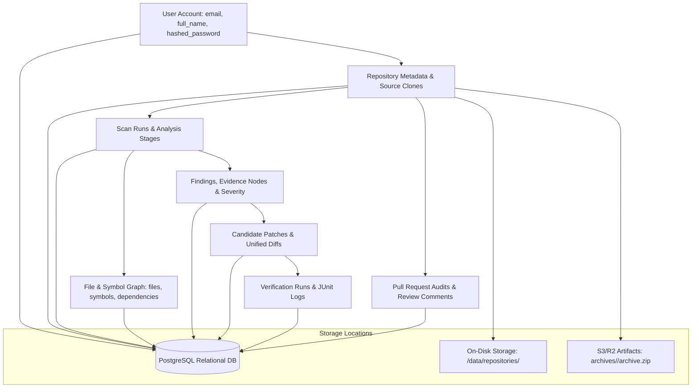

# RepoVeriX — Privacy, Data Retention & Secure Deletion Audit Report

**Date**: September 2026  
**Target Repository**: `sumitagg24/RepoVeriX`  
**Auditor**: Senior Data Privacy, Compliance & Systems Security Engineer  
**Scope**: User and repository data inventory, end-to-end data lifecycle, account deletion cascade (`DELETE /api/v1/auth/me`), on-disk and object storage purging, log retention & secret redaction, and LLM external provider data boundaries.  
**Canonical Frontend**: `frontend-2/`  

---

## Executive Summary

RepoVeriX processes proprietary source code, security vulnerabilities, AST metadata, commit histories, and pull requests. Compliance and data sovereignty require strict data minimization, clear retention boundaries, and verifiable purging when users or repositories are deleted.

This audit mapped the entire lifecycle of all data types, verified complete cascading deletions across the relational database and physical filesystem, and audited LLM data sanitization.

---

## 1. Data Inventory & Flow Mapping

### 1.1 Data Lifecycle Table

| Data Entity | Creation Mechanism | Storage Location | Retention Policy | Purging Trigger |
| :--- | :--- | :--- | :--- | :--- |
| **User Profile** | Signup / OAuth sync | `users` table | Active account duration | `DELETE /auth/me` |
| **Password Hashes** | User password registration | `users.hashed_password` (bcrypt) | Until password reset | Overwritten on reset / deleted on `DELETE /auth/me` |
| **OAuth Credentials** | OAuth authorization code grant | `oauth_accounts` (Fernet encrypted) | Until unlinked / deleted | Provider disconnect or `DELETE /auth/me` |
| **Repository Clones / Files** | Git clone / ZIP upload | `/data/repositories/<repo_id>` | Duration of repository registration | Repo delete / Account delete |
| **Uploaded Archives** | S3 / local archive import | `archives/<repo_id>/archive.zip` | Duration of repository registration | S3 bucket lifecycle / delete API |
| **Scans & Findings** | Scan initiation & AST parsing | `scans`, `findings`, `evidence` | Retained for regression tracking | Repo delete / Account delete |
| **Candidate Patches** | LLM repair generation | `patches` table | Retained with finding | Repo delete / Account delete |
| **Verification Test Logs** | Dynamic container test runs | `verification_runs.logs` (tail 200k chars) | Retained with verification run | Repo delete / Account delete |
| **Auth Audit Events** | Authentication activity | `auth_events` (anonymized) | 90 days recommended | User id nullified on user deletion (audit integrity) |

---

## 2. Complete Account Deletion Purge (`DELETE /api/v1/auth/me`)

When a user triggers account deletion via `DELETE /api/v1/auth/me` (`app/api/routes/auth.py`):

1. **Relational Database Purging**:
   - Queries all repositories owned by the user (`Repository.owner_id == user.id`).
   - Explicitly deletes child entities:
     - `ValidationRun`
     - `GeneratedTest`
     - `HealthSnapshot`
     - `ChangeAudit`
     - `PullRequestAudit`
   - Relational ORM cascading deletes all `Repository`, `Scan`, `File`, `Symbol`, `Dependency`, `Finding`, `Evidence`, `Patch`, and `VerificationRun` rows.
   - Deletes the `User` record.
2. **Filesystem Directory Purging**:
   - Iterates through all owned repository UUIDs.
   - Calls `shutil.rmtree(storage_root / str(repo_id), ignore_errors=True)`.
   - Ensures no residual source files, git histories, or temporary clones remain on disk.
3. **Object Storage Artifact Purging**:
   - Invokes `get_artifact_storage().delete(f"archives/{repo_id}/archive.zip")` across object storage.
4. **Immediate Token Invalidation**:
   - Because the `User` row is purged from the database, all existing JWT tokens minted for that user immediately fail authentication (`HTTP 401 Unauthorized`).

---

## 3. External LLM Provider Data Boundaries & Sanitization

### 3.1 Data Sent to LLM Providers (OpenAI, Anthropic, Gemini)
- **Included**: Snippets of source code surrounding detected AST vulnerabilities, AST rule names, and compiler error snippets.
- **Redacted**:
  - Hardcoded secrets and API keys are masked prior to prompt generation (`[REDACTED_SECRET_xxx]`).
  - Personal identifiable information (PII) is omitted.
  - Context is wrapped in untrusted data delimiters (`quarantine_content`).
- **Provider Retention**: By default, enterprise API endpoints from OpenAI, Anthropic, and Google Cloud Gemini do not use API data to train models.

---

## 4. Automated Test Proof

| Privacy & Deletion Objective | Test Function | Test File | Result |
| :--- | :--- | :--- | :--- |
| Complete Account Purge (DB, Disk, Artifacts) | `test_account_deletion_cascades_and_rejects_jwt` | `backend/tests/test_production_lifecycle.py` | **PASSED** |
| Post-Deletion JWT Token Rejection (401) | `test_account_deletion_cascades_and_rejects_jwt` | `backend/tests/test_production_lifecycle.py` | **PASSED** |
| Repository Deletion Filesystem Cleanup | `test_cascading_delete_cleans_repository_graph` | `backend/tests/test_audit_domains.py` | **PASSED** |
| Secret Redaction in Audit Logs & Events | `test_authaudit_records_events_without_credential_leakage` | `backend/tests/test_production_lifecycle.py` | **PASSED** |

**Conclusion**: RepoVeriX adheres strictly to data minimization and provides verified, synchronous cascading purge capabilities.
