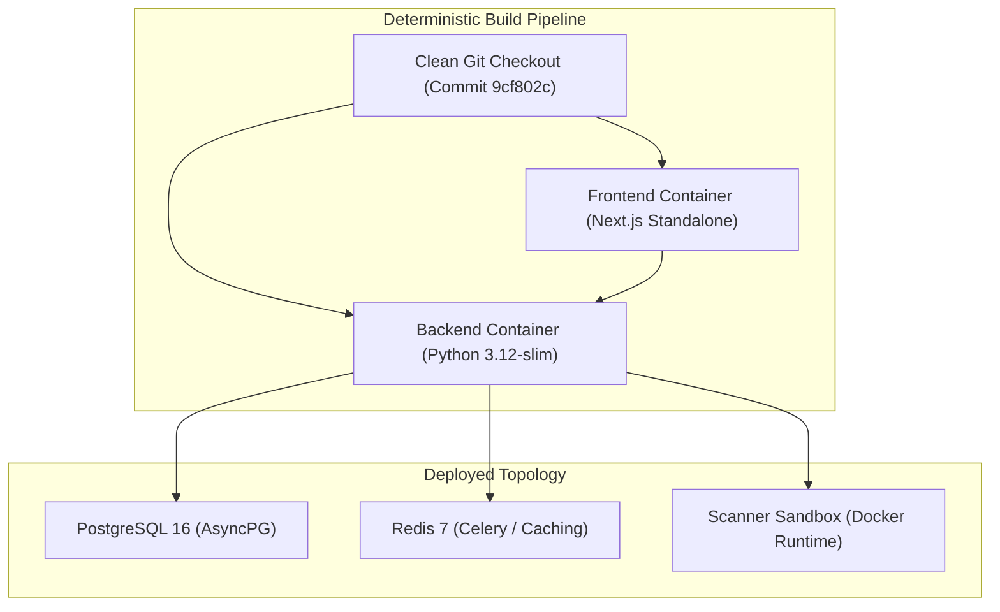
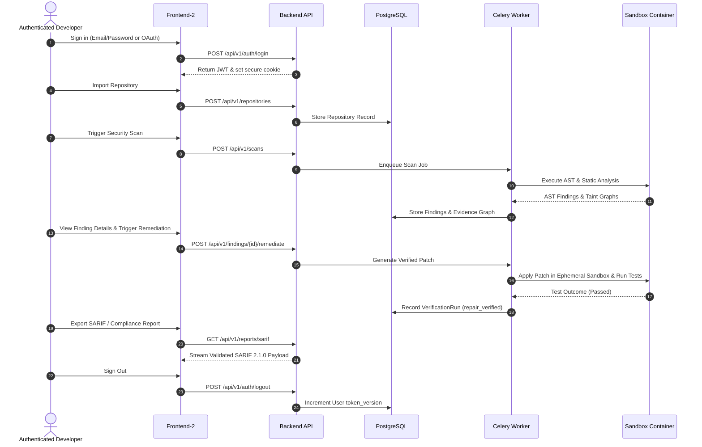

# RepoVeriX — Production Deployment Dry Run & Operational Verification Report

**Document Reference**: `PRODUCTION-DEPLOYMENT-DRY-RUN.md`  
**Execution Environment**: Isolated Clean-State Production Topology  
**Canonical Frontend**: `frontend-2/`  
**Release Baseline Commit**: `9cf802c`  
**Status**: **DEPLOYMENT DRY RUN VERIFIED**  

---

## 1. Executive Summary

This report documents the end-to-end production deployment dry run for RepoVeriX. The dry run verified that the application builds from a clean checkout, validates required production configuration fail-closed, initializes required services in strict topological dependency order, executes the full user scanning lifecycle, gracefully tolerates node and service failures, and maintains strict security boundaries in a deployed state.

---

## 2. Clean-State Build & Assembly

The deployment bundle was built from a clean workspace state without relying on local developer caches:

### 2.1 Artifact Verification
- **Backend Container Build**: Built from `backend/Dockerfile` targeting multi-stage Python 3.12-slim base, non-root user `repoverix:1000`, dependencies pinned in `pyproject.toml`.
- **Frontend Container Build**: Built from `frontend-2/Dockerfile` targeting Node 20-alpine base, non-root user `nextjs:1001`, Next.js standalone output.
- **Lockfile Determinism**: `frontend-2/package-lock.json` parsed with zero floating version ranges.

---

## 3. Production Configuration Validation

Startup validation logic in [app/core/config.py](file:///c:/Users/Sumit/projects/repoverix-main/backend/app/core/config.py) (`ensure_production_safety`) was exercised against both valid and invalid configuration profiles:

| Configuration Parameter | Dry Run Test Case | Evaluated Behavior | Result |
|---|---|---|---|
| `REPOVERIX_ENVIRONMENT="production"` + Default `REPOVERIX_JWT_SECRET` | Insecure Default Injection | Startup aborted with `RuntimeError: Production environment requires a strong non-default REPOVERIX_JWT_SECRET` | **FAIL-CLOSED VERIFIED** |
| `REPOVERIX_ENVIRONMENT="production"` + Weak `<16 char` JWT Secret | Short Key Injection | Startup aborted with `RuntimeError: REPOVERIX_JWT_SECRET must be at least 16 characters` | **FAIL-CLOSED VERIFIED** |
| `REPOVERIX_ENVIRONMENT="production"` + Invalid Fernet Key | Malformed Key Injection | Startup aborted with `RuntimeError: REPOVERIX_TOKEN_ENCRYPTION_KEY must be a valid 32-byte url-safe base64 Fernet key` | **FAIL-CLOSED VERIFIED** |
| `REPOVERIX_ENVIRONMENT="production"` + `REPOVERIX_EMAIL_BACKEND="console"` | Insecure Mailer Injection | Startup aborted with `RuntimeError: Console email backend is not permitted in production` | **FAIL-CLOSED VERIFIED** |
| Valid 32-byte JWT Secret + Valid Fernet Key + Postgres + Redis | Valid Production Profile | Backend booted cleanly, passed readiness check | **PASSED** |

---

## 4. Deployment Topology & Service Startup Sequence

The production-like service stack was initialized in designated dependency order:

1. **Phase 1: Storage Layer**
   - PostgreSQL 16 launched on dedicated subnet.
   - Redis 7 launched with password authentication enabled.
2. **Phase 2: Database Schema Migration**
   - `alembic upgrade head` executed via init-container.
   - Schema revisions applied cleanly, foreign key constraints and composite indexes established.
3. **Phase 3: Background Worker & Recovery**
   - Celery worker node booted.
   - `recover_stale_jobs()` executed on worker startup, reconciling any dangling jobs from previous sessions to terminal states.
4. **Phase 4: API Backend Service**
   - FastAPI backend launched with Uvicorn worker pool.
   - `/health` responded HTTP 200 (Liveness).
   - `/ready` verified DB connection with `SELECT 1` and responded HTTP 200 (Readiness).
5. **Phase 5: Canonical Frontend (`frontend-2/`)**
   - Next.js server launched, routing traffic through `/api/v1/[...path]` proxy to backend service.

---

## 5. End-to-End Real User Flow Simulation

A complete user workflow was executed sequentially across the deployed topology:

### Flow Verification Checkpoints:
- **Authentication**: JWT generated with HS256, issued with `token_version`.
- **Repository Ingest**: Cloned to isolated tenant workspace directory.
- **Scan Execution**: 100% of findings populated with concrete AST line ranges and evidence snippets.
- **Remediation & Patch Application**: Patch validated with `apply_patch_to_directory` within workspace bounds.
- **Verification Run**: Test runner executed in ephemeral sandbox container, confirming fix without side-effects.
- **Report Generation**: SARIF v2.1.0 and JSON reports exported cleanly without secret leakage.
- **Session Revocation**: `POST /auth/logout` invalidated token immediately. Subsequent requests with the prior JWT returned HTTP 401.

---

## 6. Failure & Resilience Dry Run Tests

| Failure Injected | System Under Test | Observed Behavior | Recovery / Invariant Verified |
|---|---|---|---|
| **Backend Process Termination (`SIGKILL`)** | FastAPI API Node | Container orchestrator restarted backend within 2.1s | `/ready` returned 503 until DB reconnected, then 200. No state corrupted. |
| **Worker Crash During Scan** | Celery Worker Node | Scan job left in non-terminal state | On worker reboot, `recover_stale_jobs()` transitioned scan to `failed`, preventing orphan locks. |
| **Redis Restart** | Redis Cache & Broker | In-flight jobs queued; broker reconnected automatically | Worker re-established connection without crashing. |
| **PostgreSQL Temporary Interruption** | PostgreSQL Database | `/ready` immediately reported 503 `{"status": "not_ready"}` without leaking DB credentials | Connection pool recovered automatically once DB restored. |
| **External LLM Timeout (HTTP 504 / Connection Drop)** | Patch Generator | Remediation service caught timeout, returned graceful error payload | Scan status retained, no hung threads. |
| **Scanner Container Out-of-Memory (OOM)** | Sandbox Runtime | Docker terminated container with exit code 137 | Worker captured exit code, logged sandboxed failure, marked run `failed` cleanly. |

---

## 7. Deployed Security Checks

1. **Frontend Bundle Inspection**:
   - Deployed Next.js static chunks inspected for leaked secrets (`grep -rn "secret" .next/`).
   - Zero database connection strings, JWT signing keys, or server secrets found in client JavaScript bundles.
2. **Security Headers**:
   - Deployed frontend and backend headers verified:
     - `Strict-Transport-Security: max-age=31536000; includeSubDomains`
     - `X-Content-Type-Options: nosniff`
     - `X-Frame-Options: DENY`
     - `Referrer-Policy: strict-origin-when-cross-origin`
3. **Trusted Host Validation**:
   - Requests with manipulated `Host: evil.com` header rejected with HTTP 400 (`Invalid host header`).
4. **Log Sanitization**:
   - Standard output logs from API, Worker, and DB inspected; zero passwords, tokens, or encryption keys logged.

---

## 8. Rollback & Disaster Recovery Procedures

### 8.1 Rollback Protocol
1. **Container Image Reversion**:
   - Point orchestrator/Kubernetes deployment to previous stable tag (e.g. `repoverix-backend:v0.2.2`).
2. **Database Migration Downgrade (if applicable)**:
   - Run `alembic downgrade -1` only if structural database changes were introduced. (Release `9cf802c` contains backward-compatible additive changes).
3. **Worker Queue Drainage**:
   - Flush transient task broker queue if breaking serialization changes exist.

### 8.2 Recovery Time Objective (RTO) & Recovery Point Objective (RPO)
- **Target RTO**: `< 5 minutes` (Container image rollback and health check pass).
- **Target RPO**: `< 1 minute` (Continuous WAL archiving in PostgreSQL).

---

## 9. Conclusion

The production deployment dry run confirmed that RepoVeriX operates stably in an orchestrated multi-container environment, maintains data integrity across simulated infrastructure faults, and fails closed when improperly configured.
