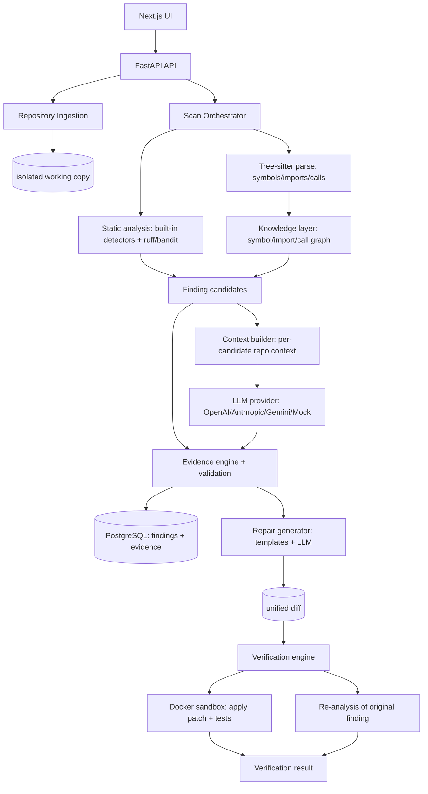

# RepoVeriX Architecture

RepoVeriX is a **research prototype** for evidence-grounded repository-level code
auditing and verified automated repair. Its central principle:

> **The LLM proposes; evidence and execution verify.**

A finding is only *reported* once repository/static evidence supports it, and a
repair is only *declared verified* once tests and static checks pass and
re-analysis shows the original defect is gone — inside an isolated sandbox.

## Modular monolith

The system is a modular monolith on purpose (no Kubernetes, no microservices).
One FastAPI process owns ingestion, analysis, LLM interaction and verification;
a Next.js app is the developer UI; PostgreSQL is the source of truth. Work that
runs long (scans, verifications) executes as in-process background tasks with a
small scheduler seam (`backend/app/analysis/runtime.py`) so a future job queue
can replace it without touching routes.



## Source layout

```
backend/
  app/
    main.py                FastAPI app + lifespan (table creation, logging)
    core/                  config (pydantic-settings, REPOVERIX_ prefix), logging, security (JWT/bcrypt)
    db/                    SQLAlchemy models, async engine/session
    analysis/              the engine (see below)
    api/                   FastAPI routers + auth/ownership dependencies
    benchmark/             RepoVeriX-Bench: experiment runner + metrics (CLI via python -m app.benchmark)
    services/reporting.py  scan report assembly (JSON dict + Markdown renderer)
    prompts/               versioned prompt files (system_security_v1, finding_analysis_v1, ...)
  tests/                   pytest suite + fixture repositories (seeded vulnerabilities)
  alembic/                 migrations scaffold
frontend/
  src/app/                 Next.js App Router pages (dashboard, repositories, scans, findings)
  src/components/          shadcn/ui components + patch verification panel
bench/                     benchmark data: configs, ground truth, reports
docs/                      this documentation set
```

## The engine (`backend/app/analysis`)

| Module            | Responsibility |
|-------------------|----------------|
| `discovery.py`    | Walk repo files (ignore rules, size caps), detect languages/package managers/tests, build manifest |
| `ingest.py`       | Safe ZIP extraction (path-traversal guards), GitHub shallow clone, isolated per-repo working copy |
| `parsing.py`      | Tree-sitter parsing: functions/classes/methods/imports/calls/decorators with locations |
| `knowledge.py`    | Symbol graph + import/call resolution for cross-file context |
| `detectors.py`    | Deterministic built-in rules (SQL injection, secrets, command injection, eval, weak crypto, ...) |
| `tools.py`        | Optional external tools (ruff, bandit) with capability detection and normalized output |
| `redaction.py`    | Secret redaction before any LLM call |
| `llm.py`          | Provider abstraction (OpenAI/Anthropic/Gemini/Mock), JSON parsing, retries, usage/cost tracking |
| `context.py`      | Builds a small, relevant context package per candidate (never whole repos) |
| `evidence.py`     | Candidate construction + evidence-grounded validation into VERIFIED/PROBABLE/REJECTED |
| `orchestrate.py`  | Scan pipeline per experimental configuration; persists AnalysisRun rows per stage |
| `patchops.py`     | Unified-diff generate/parse/apply (apply only inside a working copy) |
| `repair.py`       | Deterministic rule templates first, LLM repair fallback with validation |
| `verify.py`       | Sandboxed verification: copy → apply patch → static checks → tests → re-analysis |
| `runtime.py`      | In-process background scheduling + cancellation |

## Experimental configurations

A scan's `configuration` selects which pipeline stages run:

| Configuration | Pipeline | Produces |
|---|---|---|
| `static_only` | parsing → static analysis → evidence validation | Findings (static) |
| `llm_only`    | parsing → repo-review LLM → grounding validation | Findings (llm) |
| `static_llm`  | static analysis → per-candidate LLM reasoning | Findings (hybrid) |
| `repoverix`   | static analysis + repo context + LLM + evidence validation (full) | Findings (hybrid) |

Every stage is persisted as an `AnalysisRun` row (stage, tool, status, output,
timing) — the scan never silently skips work, and reproducibility metadata
(analyzer version, prompt version, tool versions, LLM config, commit) is stored
in `scan.summary`.

## Key guarantees

- **Original repositories are never mutated.** Ingestion extracts a working
  copy; repairs produce diffs; verification applies those diffs to a disposable
  sandbox copy and deletes it afterwards.
- **Repository content is untrusted data.** All execution happens inside Docker
  with CPU/memory/time limits, no host secrets, controlled networking.
- **Nothing is fabricated.** Verification verdicts require execution; benchmark
  metrics require real runs (see `docs/experiments.md`).
