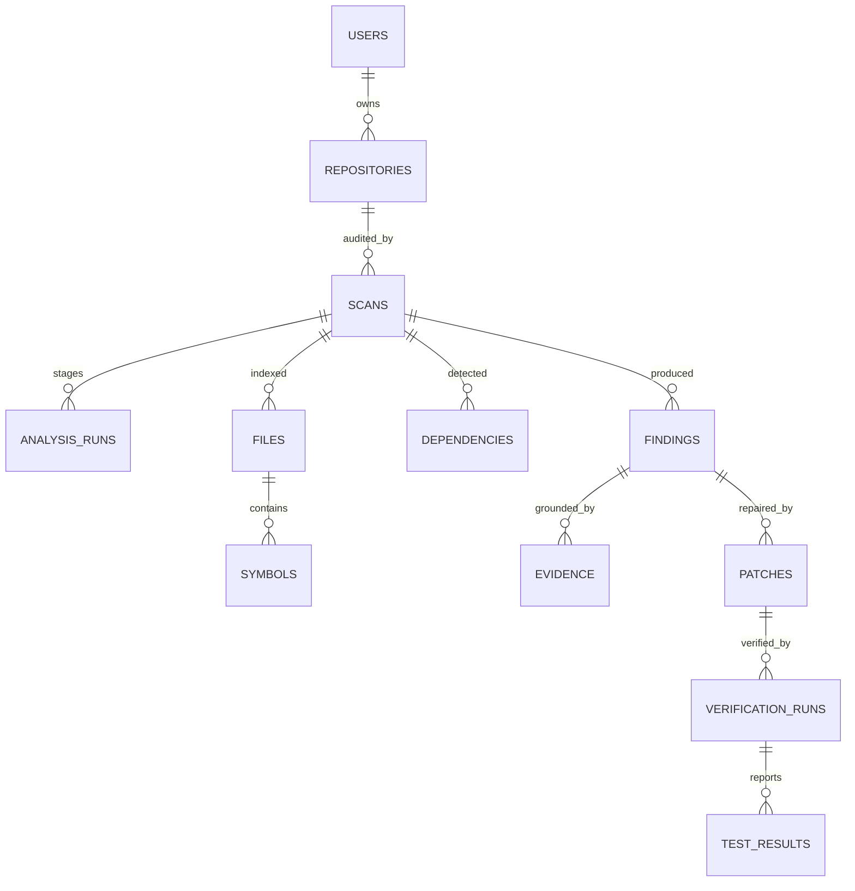

# Database

PostgreSQL via SQLAlchemy async (`asyncpg`), SQLAlchemy 2.0 typed models in
`backend/app/db/models.py`. `REPOVERIX_DATABASE_URL` overrides; SQLite
(`sqlite+aiosqlite`) is supported for local development and tests.

## Entities and relationships

| Table | Key columns | Notes |
|---|---|---|
| `users` | email (unique), hashed_password, full_name | JWT auth |
| `repositories` | owner_id, source_type (`github`/`zip`), source_url, default_branch, storage_path, primary_languages, status | one row per uploaded/cloned repo |
| `scans` | repository_id, status, configuration (`static_only`/`llm_only`/`static_llm`/`repoverix`), started/finished, summary (JSON incl. reproducibility), llm_token_usage, error | the audit unit |
| `analysis_runs` | scan_id, stage, tool_name, status, output (JSON), started/finished | one row per pipeline stage |
| `files` | scan_id, path, language, size_bytes, sha256, is_test | persisted parsed metadata |
| `symbols` | file_id, kind, name, qualified_name, line range, metadata (JSON) | functions/methods/classes |
| `dependencies` | scan_id, ecosystem, name, version, is_dev | from requirements/package manifests |
| `findings` | scan_id, external_id (unique w/ scan), category, severity, status, confidence, title, description, impact, recommendation, file_path, function_name, line range, source | `source` = static/llm/hybrid |
| `evidence` | finding_id, kind, file/line, snippet, description, order_index, metadata (JSON) | ordered evidence chain |
| `patches` | finding_id, diff (unified), explanation, generated_by, status | candidate repairs |
| `verification_runs` | patch_id, status, patch_applied, deps_installed, tests_passed, static_passed, finding_still_detected, logs, started/finished | isolated execution results |
| `test_results` | verification_run_id, test_name, outcome, output | parsed JUnit per test |

## Conventions

- UUID primary keys; `created_at`/`updated_at` mixins on all tables.
- Enums (statuses, kinds, severities) are stored as enum *values* via
  `enum_type()`.
- Deletes cascade owner → repositories → scans → findings/patches →
  verification runs.
- Findings de-duplicate on `(scan_id, external_id)`, making scans idempotent.
- Large free text (evidence snippets, logs, diffs) lives in `Text` columns and
  is truncated at write time.

## Schema changes

Tables auto-create on startup when `REPOVERIX_AUTO_CREATE_TABLES=true`
(development/tests). The `alembic/` scaffold exists for migration-based
deployments.
